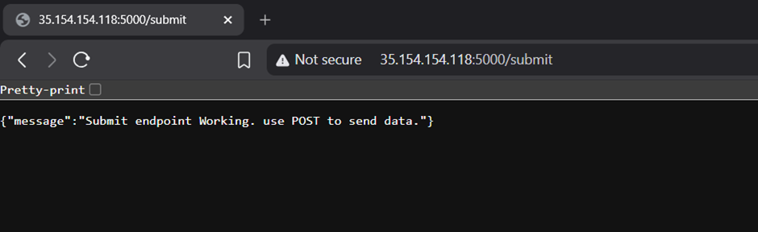
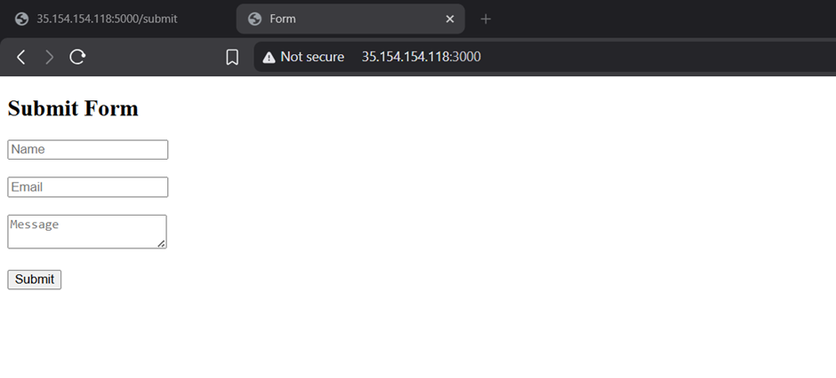
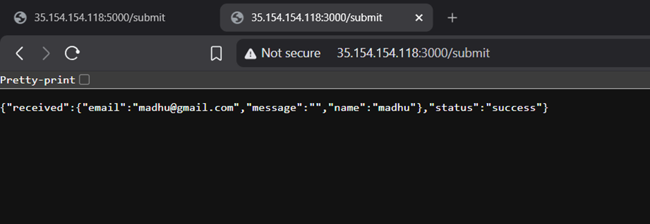
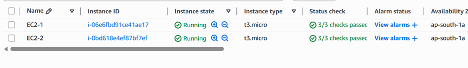
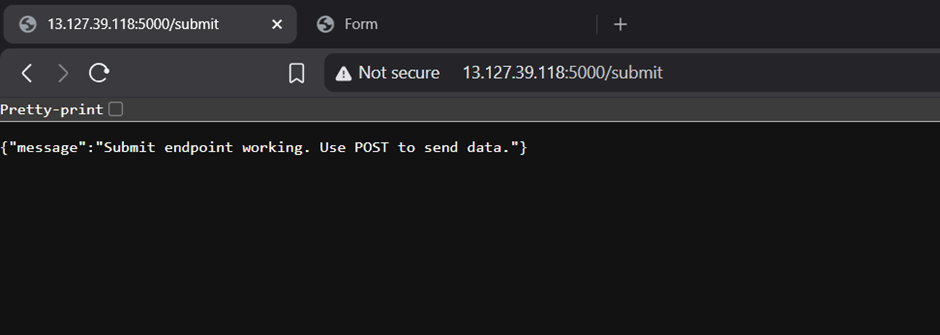
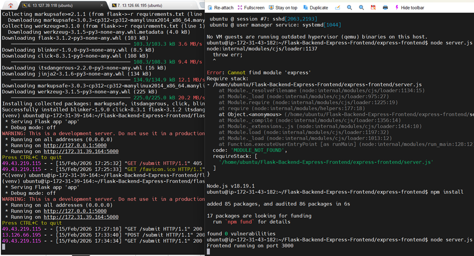
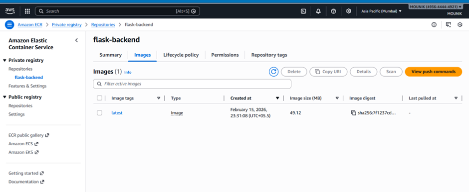

## 1. Project Overview
This project demonstrates deploying a Flask backend API and an Express frontend application on Amazon Web Services using three different architectures:
- Single EC2 Instance Deployment
- Separate EC2 Instances Deployment
- Dockerized Deployment using Amazon ECR, ECS (Fargate), and VPC.

## 2. Single EC2 Deployment
Both Flask and Express applications are deployed on a single EC2 instance. Nginx is configured as a reverse proxy to route traffic.

## 3. Separate EC2 Deployment
Frontend and backend applications are deployed on separate EC2 instances. The frontend communicates with the backend using the backend’s public IP.

 

## 4. Docker + ECR + ECS + VPC Deployment
Both applications are containerized using Docker. Docker images are pushed to Amazon ECR and deployed using ECS Fargate inside a VPC. An Application Load Balancer (ALB) exposes the application publicly.

