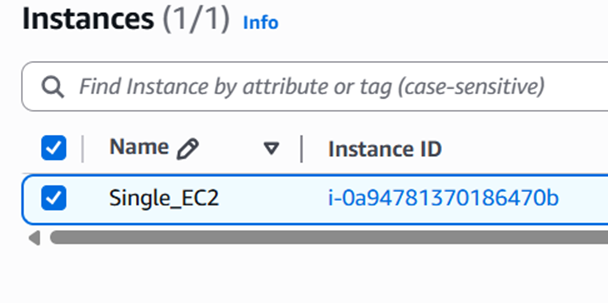
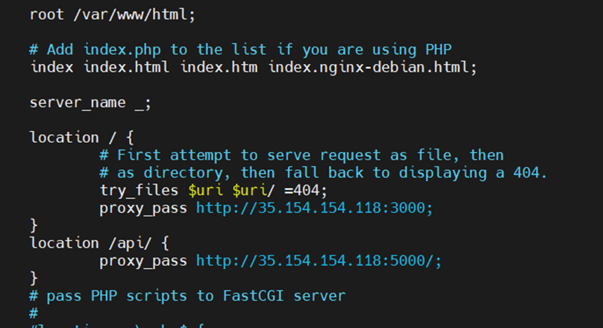

## Flask + Node.js Docker Project

### Run Locally

```bash
docker-compose up --build
```
## 1. Project Overview
This project demonstrates deploying a Flask backend API and an Express frontend application on Amazon Web Services using three different architectures:
- Single EC2 Instance Deployment
- Separate EC2 Instances Deployment
- Dockerized Deployment using Amazon ECR, ECS (Fargate), and VPC.

## 2. Single EC2 Deployment
Both Flask and Express applications are deployed on a single EC2 instance. Nginx is configured as a reverse proxy to route traffic.







